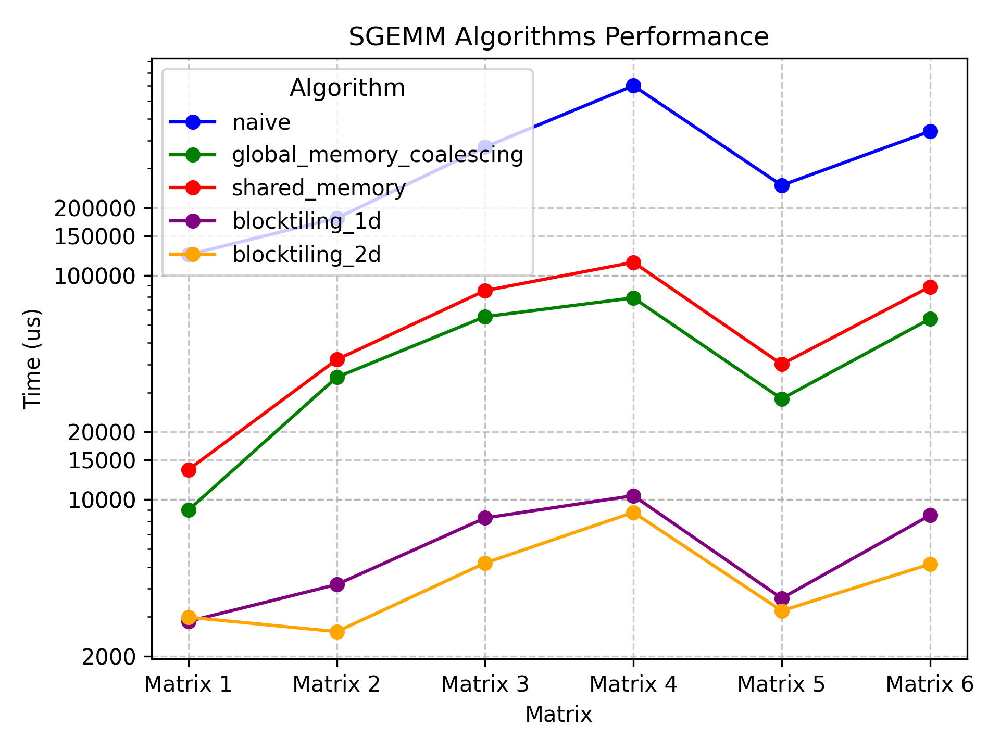

# UNIVERSAL SGEMM CUDA

> 仓库更新中，欢迎佬们提pr

## Quick Run

```bash
GEMM_MODE=0
mkdir build
cd build
cmake ..
make
./sgemm 32 1605632 27 $GEMM_MODE
```

## Naive

在CUDA编程模型中，计算被划分为三个层次：网格、块和线程。每个块最多包含1024个线程，并且它们可以访问相同的共享内存区域。首个内核采用了这些层次结构，其中每个线程负责计算矩阵C中的一个元素，通过启动多个块和线程进行异步执行。

详细介绍：[朴素GEMM](https://space.keter.top/docs/high_performance/GEMM%E4%BC%98%E5%8C%96%E4%B8%93%E9%A2%98/naive-gemm)

## Global Memory Coalescing

在深入全局内存合并之前，我们需要了解warp的概念。在执行过程中，一个块的线程被组成为warp，每个warp包含32个线程。一个warp被分配给一个warp调度器，即物理核心。

在Volta架构之前，所有warp的线程来自同一个指令流。然而，自Volta以来，不同分支的指令可能交错执行，因此依赖“warp同步”不再可靠。每个多处理器有四个warp调度器，基于线程ID进行分组。

为了实现全局内存合并，属于同一warp的线程进行的顺序内存访问可以被合并，这在优化GMEM内存访问中很关键。通过改变线程分配的方式，实现线程之间的连续内存访问，我们可以提高吞吐量。全局内存协同将吞吐量从15GB/s提升到110GB/s，性能达到2000GFLOPS，较初始内核的300GFLOPS有显著提升。

详细介绍：[全局内存合并](https://space.keter.top/docs/high_performance/GEMM%E4%BC%98%E5%8C%96%E4%B8%93%E9%A2%98/global-memory-coalescing)

## Shared Memory


在GPU中，共享内存（SMEM）是一块位于芯片上的小区域，有较低延迟和高带宽。A100 GPU内存层次结构中显示了其逻辑分区。在新的内核中，通过将A和B的一块加载到共享内存中，最大程度地利用了共享内存的性能优势，提高了性能至约2200 GFLOPS，相较于之前的版本提高了50%。然而，尽管实现了更高的内存带宽，但由于低算术强度，整体性能仍不如cuBLAS。

详细介绍：[共享内存缓存块](https://space.keter.top/docs/high_performance/GEMM%E4%BC%98%E5%8C%96%E4%B8%93%E9%A2%98/%E5%85%B1%E4%BA%AB%E5%86%85%E5%AD%98%E7%BC%93%E5%AD%98%E5%9D%97)

## Blocktiling 1d

新的内核在保持与前一个相似的基础上，引入了一个新的内循环，用于计算每个线程的多个C条目。通过最大程度地利用共享内存，该内核达到了约8600 GFLOPs的性能，比之前的版本提高了50%。该内核的优化主要体现在减少了内存访问次数，提高了算术强度，尽管整体性能仍受限于内存。

详细介绍：[Blocktiling 1d](https://space.keter.top/docs/high_performance/GEMM%E4%BC%98%E5%8C%96%E4%B8%93%E9%A2%98/%E4%B8%80%E7%BB%B4Thread%20Tile%E5%B9%B6%E8%A1%8C%E4%BC%98%E5%8C%96)

## Blocktiling 2d

第五个内核的核心思想是使每个线程能够计算一个8*8的C元素网格。在内核的第一阶段，所有线程共同填充SMEM缓存，每个线程负责加载多个元素。随后，每个线程计算其相关的SMEM条目相乘，并将结果累加到本地寄存器中。通过明晰加载值到寄存器并减少SMEM访问次数，该内核在性能上达到了约16 TFLOPs，相较于前一版本提高了2倍。

详细介绍：[Blocktiling 2d](https://space.keter.top/docs/high_performance/GEMM%E4%BC%98%E5%8C%96%E4%B8%93%E9%A2%98/%E4%BA%8C%E7%BB%B4Thread%20Tile%E5%B9%B6%E8%A1%8C%E4%BC%98%E5%8C%96)

## Results

```
$GEMM_MODE=0/1/2/3/4/5
./sgemm 32 1605632 27 $GEMM_MODE
./sgemm 384 14161 1152 $GEMM_MODE
./sgemm 256 43264 1152 $GEMM_MODE
./sgemm 64 1605632 147 $GEMM_MODE
./sgemm 64 559104 147 $GEMM_MODE
./sgemm 256 50176 1024 $GEMM_MODE
```


| M | N | K    | Algorithm | Time (us) |
|---|---|---   |-----------|-----------|
|32|1605632|27 |naive|123707|
|384|14161|1152|naive|179951|
|256|43264|1152|naive|373887|
|64|1605632|147|naive|702349|
|64|559104|147 |naive|252176|
|256|50176|1024|naive|439462|
|32|1605632|27|global_memory_coalescing|8976.98|
|384|14161|1152|global_memory_coalescing|35116.6|
|256|43264|1152|global_memory_coalescing|65442|
|64|1605632|147|global_memory_coalescing|79366|
|64|559104|147|global_memory_coalescing|28115.3|
|256|50176|1024|global_memory_coalescing|63925.2|
|32|1605632|27|shared_memory|13594.9|
|384|14161|1152|shared_memory|42083.7|
|256|43264|1152|shared_memory|85513.6|
|64|1605632|147|shared_memory|114396|
|64|559104|147|shared_memory|40141.6|
|256|50176|1024|shared_memory|88951.5|
|32|1605632|27|blocktiling_1d|2858.95|
|384|14161|1152|blocktiling_1d|4176.16|
|256|43264|1152|blocktiling_1d|8272.45|
|64|1605632|147|blocktiling_1d|10400.3|
|64|559104|147|blocktiling_1d| 3626.16|
|256|50176|1024|blocktiling_1d|8499.03|
|32|1605632|27|blocktiling_2d|2983.98|
|384|14161|1152|blocktiling_2d|2572.57|
|256|43264|1152|blocktiling_2d|5207.49|
|64|1605632|147|blocktiling_2d|8763.37|
|64|559104|147|blocktiling_2d| 3188.26|
|256|50176|1024|blocktiling_2d|5149.85|




# 参考资料

1. https://github.com/wangzyon/NVIDIA_SGEMM_PRACTICE
2. https://siboehm.com/articles/22/CUDA-MMM
3. https://zhuanlan.zhihu.com/p/372973726
